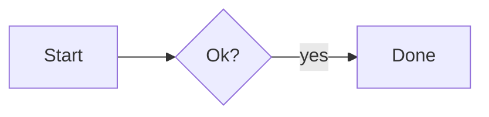

# Heading One

## Heading Two

Paragraph with **bold**, *italic*, and `code`.

| Tool | Lang |
|------|------|
| glow | Go |
| mdcat | Rust |

```mermaid
flowchart LR
  A[Start] --> B{Ok?}
  B -->|yes| C[Done]
```

> a quote
